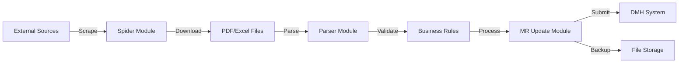

# DMH MR Tool 🚀

[](https://www.python.org/downloads/)
[](LICENSE)
[](https://github.com/features/actions)
[](https://github.com/psf/black)

A lightweight, enterprise-grade automation utility for streamlining Australian financial market data processing, reducing daily processing time from 2-3 hours to under 30 minutes.

## 📋 Table of Contents

- [Overview](#overview)
- [Key Features](#key-features)
- [System Requirements](#system-requirements)
- [Installation](#installation)
- [Configuration](#configuration)
- [Usage](#usage)
- [Architecture](#architecture)
- [Development](#development)
- [Testing](#testing)
- [Deployment](#deployment)
- [Troubleshooting](#troubleshooting)
- [Contributing](#contributing)
- [Support](#support)
- [License](#license)

## 🎯 Overview

The **DMH_MR_Tool** is an internal automation solution designed to:
- **Collect** financial market data from ASX, iShares, BetaShares, and Vanguard
- **Extract** key data from Excel and PDF reports
- **Process** information based on client-specific business rules
- **Update** the internal DMH (Data Management Hub) Master Rate system
- **Minimize** human error and improve data accuracy

### Business Impact

| Metric | Before | After | Improvement |
|--------|--------|-------|-------------|
| Processing Time | 2-3 hours/day | <30 minutes | **85% reduction** |
| Error Rate | 5-10% | <1% | **90% reduction** |
| Data Volume | 10-20 records/day | 100+ records/day | **5x capacity** |
| Manual Steps | 50+ | 5-10 | **80% automation** |

## ✨ Key Features

### 🕷️ **Spider Module**
- Automated daily data collection from multiple sources
- Intelligent rate limiting and retry logic
- Concurrent downloading with progress tracking
- Automatic PDF download for matching tickers

### 📄 **Parser Module**
- Multi-format support (PDF, Excel, CSV)
- Template-based extraction with 5-6 layout patterns
- Automatic format detection
- Business rule application

### 🔄 **MR Update Module**
- Direct DMH system integration
- Validation before submission
- Automatic backup creation
- Real-time status tracking

### 🗄️ **Database Browser**
- SQL query interface
- Data export capabilities
- Read-only access for general users
- Admin access for developers

### ⚙️ **Settings Module**
- Centralized configuration management
- Real-time log viewing
- Path customization
- User preferences

## 💻 System Requirements

### Software
- **OS**: Windows 10/11 (64-bit)
- **Python**: 3.9 or higher
- **Access**: 
  - Shared network drives (`//shared/`)
  - GMAS Automation Launcher
  - DMH system credentials


## 🚀 Installation

### 1. Prerequisites

```bash
# Verify Python installation
python --version  # Should be 3.9+

# Verify pip
pip --version

# Verify network access
ping asx.com.au
```

### 2. Clone Repository

```bash
# Clone from internal repository
git clone https://github.com/company/dmh_mr_tool.git
cd dmh_mr_tool
```

### 3. Set Up Virtual Environment

```bash
# Create virtual environment
python -m venv venv

# Activate virtual environment
# On Windows:
venv\Scripts\activate
# On Linux/Mac:
source venv/bin/activate
```

### 4. Install Dependencies

```bash
# Install production dependencies
pip install -r requirements.txt

# For development (includes testing tools)
pip install -r requirements-dev.txt

# Install pre-commit hooks (for developers)
pre-commit install
```

### 5. Database Setup

```bash
# Initialize database
python scripts/setup_db.py

# Verify database creation
python -c "from src.dmh_mr_tool.database.connection import DatabaseManager; print('Database OK')"
```

### 6. Configuration Setup

```bash
# Create config directory on shared drive
mkdir -p //shared/configs/dmh_mr_tool

# Copy configuration template
cp config/config.ini.template //shared/configs/dmh_mr_tool/config.ini

# Edit configuration (use your preferred editor)
notepad //shared/configs/dmh_mr_tool/config.ini
```

## ⚙️ Configuration

### Configuration File Structure

```ini
[environment]
environment = production  # Options: development, testing, staging, production

[database]
path = //shared/data/dmh_mr_tool/dmh_tool.db
backup_path = //shared/data/dmh_mr_tool/backups/
pool_size = 5
echo = false  # Set to true for SQL logging

[paths]
download_path = //shared/data/dmh_mr_tool/downloads/
backup_path = //shared/data/dmh_mr_tool/backups/
log_path = //shared/data/dmh_mr_tool/logs/
temp_path = //shared/data/dmh_mr_tool/temp/
shared_config_path = //shared/configs/dmh_mr_tool/

[scraper]
asx_base_url = https://www.asx.com.au
max_retries = 3
timeout = 30
rate_limit_delay = 1.0  # Seconds between requests
concurrent_downloads = 3

[logging]
level = INFO  # Options: DEBUG, INFO, WARNING, ERROR, CRITICAL
format = json
max_file_size = 5242880  # 5MB
backup_count = 5

[dmh]
api_url = https://dmh.internal.company.com/api
api_key = ${DMH_API_KEY}  # Set as environment variable
timeout = 60
```

### Environment Variables

```bash
# Windows
set DMH_CONFIG_PATH=//shared/configs/dmh_mr_tool/config.ini
set DMH_API_KEY=your-api-key-here

# Linux/Mac
export DMH_CONFIG_PATH=//shared/configs/dmh_mr_tool/config.ini
export DMH_API_KEY=your-api-key-here
```

## 📖 Usage

### Starting the Application

```bash
# Run the application
python -m dmh_mr_tool.main

# Or using the Makefile
make run
```

### User Interface Navigation

### Module Usage

#### 1. Spider Module - Daily Update

1. Navigate to Spider interface (`Ctrl+2`)
2. Click **"Run Daily Update"** button
3. Monitor progress in the progress bar
4. Review results in the activity log

#### 2. Parser Module - File Processing

1. Navigate to Parser interface (`Ctrl+3`)
2. Drag and drop files into the gray area
3. Select appropriate template from dropdown
4. Review parsed data in the form
5. Click **"Submit to MR Update"** to proceed

#### 3. MR Update Module - Data Submission

1. Navigate to MR Update interface (`Ctrl+4`)
2. Review/edit data in the table
3. Click **"Submit to DMH"** button
4. Monitor status column for results
5. Backup files automatically created

#### 4. Database Browser - Query Data

```sql
-- Example queries
-- Get today's announcements
SELECT * FROM asx_info 
WHERE pub_date = DATE('now') 
ORDER BY update_timestamp DESC;

-- Get unprocessed items
SELECT * FROM asx_info 
WHERE downloaded = 0;

-- Check system log
SELECT * FROM sys_log 
WHERE DATE(update_timestamp) = DATE('now') 
ORDER BY id DESC LIMIT 100;
```

### Command Line Interface

```bash
# Run specific spider
python -m dmh_mr_tool.scrapers.asx_scraper --date 2025-01-15

# Parse specific file
python -m dmh_mr_tool.parsers.pdf_parser --file /path/to/file.pdf --template asx_nz

# Batch processing
python -m dmh_mr_tool.business.batch_processor --folder /path/to/folder
```

## 🏗️ Architecture

### System Architecture

```
┌─────────────────────────────────────────────────────────┐
│                    User Interface (PySide6)              │
├─────────────────────────────────────────────────────────┤
│                    Business Logic Layer                  │
│  ┌──────────┐  ┌──────────┐  ┌──────────┐  ┌────────┐ │
│  │ Services │  │  Rules   │  │Validation│  │Mappers │ │
│  └──────────┘  └──────────┘  └──────────┘  └────────┘ │
├─────────────────────────────────────────────────────────┤
│                      Data Access Layer                   │
│  ┌──────────┐  ┌──────────┐  ┌──────────┐             │
│  │Repository│  │  Models  │  │Connection│             │
│  └──────────┘  └──────────┘  └──────────┘             │
├─────────────────────────────────────────────────────────┤
│                    External Systems                      │
│  ┌──────┐  ┌────────┐  ┌──────┐  ┌──────┐  ┌──────┐  │
│  │ ASX  │  │Vanguard│  │Shares│  │ DMH  │  │ GMAS │  │
│  └──────┘  └────────┘  └──────┘  └──────┘  └──────┘  │
└─────────────────────────────────────────────────────────┘
```

### Data Flow



### Database Schema

```sql
-- Core tables
asx_info          -- ASX announcement metadata
asx_nz_data       -- Parsed financial data
vanguard_data     -- Vanguard fund information
vanguard_mapping  -- Asset ID mappings
column_map        -- Component code mappings
sys_log           -- System activity log
```

## 🔧 Development

### Project Structure

```
src/dmh_mr_tool/
├── config/        # Configuration management
├── core/          # Core utilities and logging
├── database/      # Database models and repositories
├── scrapers/      # Web scraping implementations
├── parsers/       # Document parsing logic
├── business/      # Business logic and rules
├── ui/            # User interface components
└── integration/   # External system integrations
```

### Code Style Guidelines

```python
# Follow PEP 8 with Black formatting
# Use type hints for all functions
def process_data(data: Dict[str, Any]) -> ProcessResult:
    """
    Process financial data with business rules.
    
    Args:
        data: Input data dictionary
        
    Returns:
        ProcessResult with status and processed data
    """
    pass

# Use docstrings for all public methods
# Implement logging decorators for debugging
@log_execution(timed=True)
def critical_function():
    pass
```

### Adding New Features

1. **Create feature branch**
```bash
git checkout -b feature/new-parser
```

2. **Implement with tests**
```python
# src/dmh_mr_tool/parsers/new_parser.py
class NewParser(BaseParser):
    def parse(self, file_path: Path) -> Dict[str, Any]:
        # Implementation
        pass

# tests/unit/test_new_parser.py
def test_new_parser():
    parser = NewParser()
    result = parser.parse(test_file)
    assert result["status"] == "success"
```

3. **Run quality checks**
```bash
make lint
make format
make test
```

4. **Submit pull request**
```bash
git push origin feature/new-parser
# Create PR on GitHub
```

## 🧪 Testing

### Running Tests

```bash
# Run all tests
pytest

# Run with coverage report
pytest --cov=dmh_mr_tool --cov-report=html

# Run specific test file
pytest tests/unit/test_parser.py

# Run specific test
pytest tests/unit/test_parser.py::test_pdf_parsing

# Run tests in parallel
pytest -n auto

# Run with verbose output
pytest -v
```

### Test Categories

```bash
# Unit tests only
pytest tests/unit/

# Integration tests
pytest tests/integration/

# End-to-end tests
pytest tests/e2e/

# Performance tests
pytest tests/performance/ --benchmark-only
```

### Writing Tests

```python
# Example test structure
import pytest
from pathlib import Path
from dmh_mr_tool.parsers.pdf_parser import PDFParser

class TestPDFParser:
    @pytest.fixture
    def parser(self):
        return PDFParser()
    
    @pytest.fixture
    def sample_pdf(self, tmp_path):
        pdf_file = tmp_path / "test.pdf"
        # Create test PDF
        return pdf_file
    
    def test_parse_valid_pdf(self, parser, sample_pdf):
        result = parser.parse(sample_pdf)
        assert result["_status"] == "success"
        assert "ex_date" in result
    
    def test_parse_invalid_file(self, parser):
        with pytest.raises(ParserError):
            parser.parse(Path("nonexistent.pdf"))
```

## 📦 Deployment

### Local Deployment

```bash
# Build deployment package
make build

# Or manually
python scripts/build.py
```

### GMAS Deployment

1. **Create deployment package**
```bash
python scripts/deploy.py
```

2. **Upload to GMAS**
```bash
# This creates DMH_MR_Tool.deploy file
# Upload via GMAS portal or CLI
gmas upload DMH_MR_Tool.deploy
```

3. **User Installation**
- Download .gmas file from GMAS portal
- Run via Automation Launcher
- Tool loads from cloud automatically

### Docker Deployment (Development)

```bash
# Build Docker image
docker build -t dmh-mr-tool .

# Run container
docker-compose up -d

# View logs
docker-compose logs -f

# Stop container
docker-compose down
```

### Production Checklist

- [ ] All tests passing
- [ ] Code review completed
- [ ] Documentation updated
- [ ] Configuration verified
- [ ] Backup strategy confirmed
- [ ] Monitoring enabled
- [ ] User training completed
- [ ] Rollback plan ready

## 🔍 Troubleshooting

### Common Issues

#### 1. Database Connection Error
```bash
# Error: Cannot connect to database
# Solution:
- Check network drive access
- Verify database path in config.ini
- Ensure write permissions on database folder
```

#### 2. Scraper Timeout
```bash
# Error: Scraper timeout exceeded
# Solution:
- Check internet connectivity
- Increase timeout in config.ini
- Verify website accessibility
```

#### 3. Parser Template Not Found
```bash
# Error: Template 'xxx' not found
# Solution:
- Check available templates: python -m dmh_mr_tool.parsers.list_templates
- Use correct template name
- Update template if format changed
```

#### 4. DMH Update Failed
```bash
# Error: Failed to update DMH
# Solution:
- Verify DMH API credentials
- Check network connectivity to DMH
- Review validation errors in log
- Ensure data format is correct
```

### Debug Mode

```bash
# Enable debug logging
set DMH_DEBUG=true
python -m dmh_mr_tool.main --debug

# Check logs
tail -f //shared/data/dmh_mr_tool/logs/dmh_tool.log
```

### Performance Optimization

```python
# Monitor performance
from dmh_mr_tool.core.monitoring import PerformanceMonitor

monitor = PerformanceMonitor()
monitor.start()
# ... operations ...
monitor.stop()
print(monitor.report())
```

## 🤝 Contributing

### Commit Message Convention

```bash
# Format: <type>(<scope>): <subject>

feat(parser): add support for new PDF format
fix(spider): handle connection timeout
docs(readme): update installation instructions
test(parser): add edge case tests
refactor(database): optimize query performance
```

### Code Review Checklist

- [ ] Code follows style guidelines
- [ ] Tests added/updated
- [ ] Documentation updated
- [ ] No security vulnerabilities
- [ ] Performance impact considered
- [ ] Backward compatibility maintained

## 📞 Support

### Support Channels

- **Email**: dmh-support@company.com
- **Teams**: DMH Support Channel
- **Wiki**: https://wiki.company.com/dmh-mr-tool
- **Issue Tracker**: https://jira.company.com/dmh

### Support Levels

| Level | Response Time | Contact |
|-------|--------------|---------|
| Critical | 1 hour | Phone: x1234 |
| High | 4 hours | Teams/Email |
| Medium | 1 day | Email |
| Low | 3 days | Wiki/Email |

### Frequently Asked Questions

**Q: How often should I run the daily update?**
A: Once per business day, typically in the morning.

**Q: Can I modify the business rules?**
A: Yes, but changes should be tested in development first.

**Q: How do I add a new data source?**
A: Create a new scraper class inheriting from BaseScraper.

**Q: What's the backup retention policy?**
A: 30 days for automated backups, 1 year for monthly archives.

## 📄 License

This software is proprietary and confidential. All rights reserved.

**Internal Use Only** - Not for distribution outside the organization.

---

## 🚀 Quick Start Guide

```bash
# 1. Clone and setup
git clone https://github.com/company/dmh_mr_tool.git
cd dmh_mr_tool
python -m venv venv
venv\Scripts\activate
pip install -r requirements.txt

# 2. Configure
cp config/config.ini.template //shared/configs/dmh_mr_tool/config.ini
python scripts/setup_db.py

# 3. Run
python -m dmh_mr_tool.main

# 4. Daily workflow
# - Click "Run Daily Update" in Spider
# - Review new files in Parser
# - Submit updates in MR Update
# - Verify in DB Browser
```

---

**Version**: 1.0.0 | **Last Updated**: January 2025 | **Maintained by**: Development Team